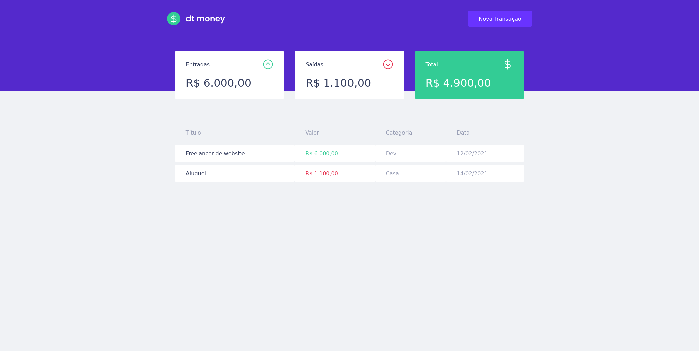

<h1 align="center">
  
</h1>

## 💬  Sobre
O dt money é uma alternativa simples e eficaz para gerenciar suas finanças, permitindo o cadastro de entradas, saídas e a organização das mesmas em categorias.

<br>

## Tecnologias

Tecnologias e ferramentas utilizadas no desenvolvimento do projeto:
<div align="left">  
 


</div>

<br>

<div align="left">  

- [⚙️ MirageJS](https://miragejs.com/)
- [⚙️ Axios](https://github.com/axios/axios)
- [⚙️ Polished](https://polished.js.org/)
<div>
<br>

## Instalação e uso

```bash
# Abra um terminal e copie este repositório com o comando
git clone https://github.com/martins-rafael/dtmoney.git
# ou use a opção de download.
# Entre na pasta web com 
cd dtmoney
# Instale as dependências
yarn install
# Rode a aplicação
yarn start
```

<br>

## 👨🏻‍🚀 Me acompanhe no Linkedin também:
<div align="left">
<a href="https://www.linkedin.com/in/isaacmarcosoficial/">


</a>
</div>
